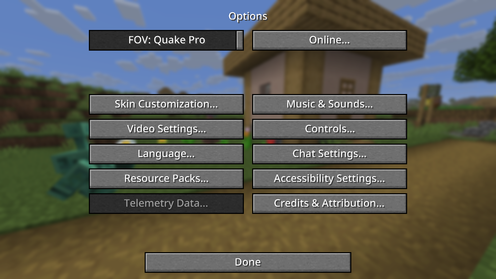
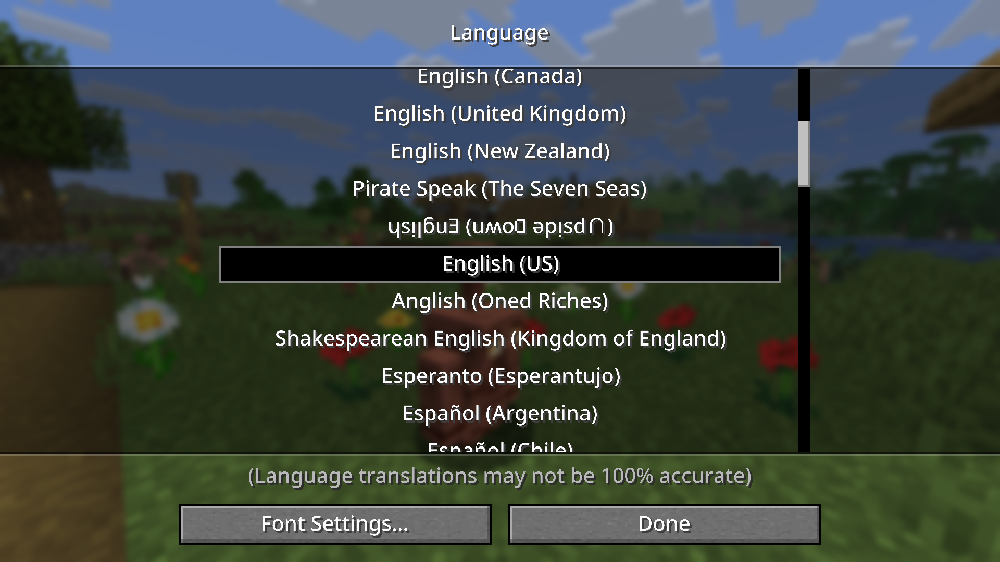
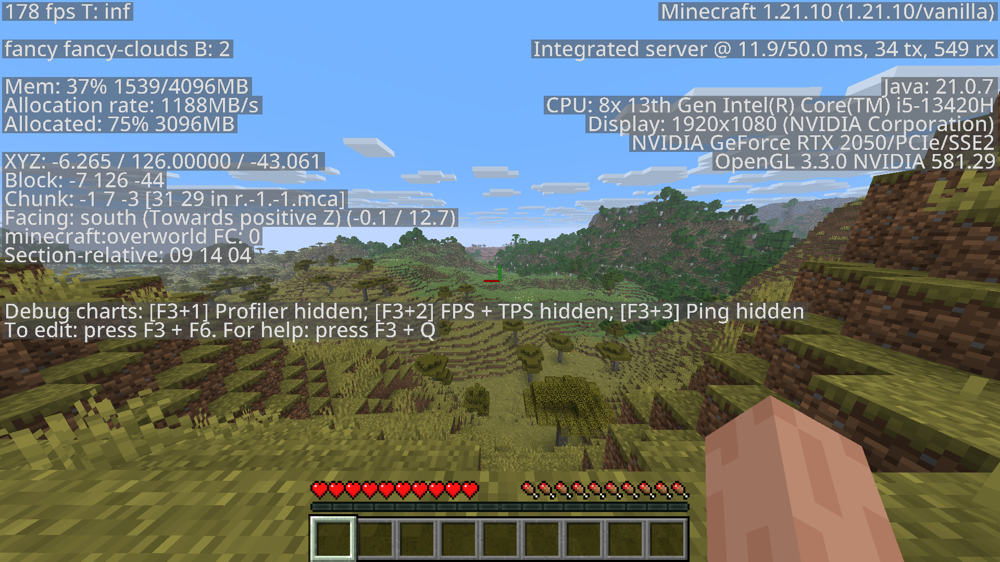

# Noto Sans Typeface Pack (Minecraft Java)

A clean and modern global typeface for Minecraft Java Edition.
Supports multiple languages with a consistent, easy-to-read design.

## Features
- Based on **Noto Sans Medium** and **Noto Emoji**
- Supports every language on Minecraft Java
- Clean and minimal look for UI and chat
- Works for newest version Minecraft Java

## Installation
1. Download your version:
   - [1.21](NotoSansTypefacePack_1.21.zip)
2. Move it to your `resourcepacks` folder
3. Enable it in **Options** > **Resource Packs**

## Preview

## Credits
- Typeface by **Google Fonts (Noto Project)**
- Resource pack by **Saransak Lueangoon**
