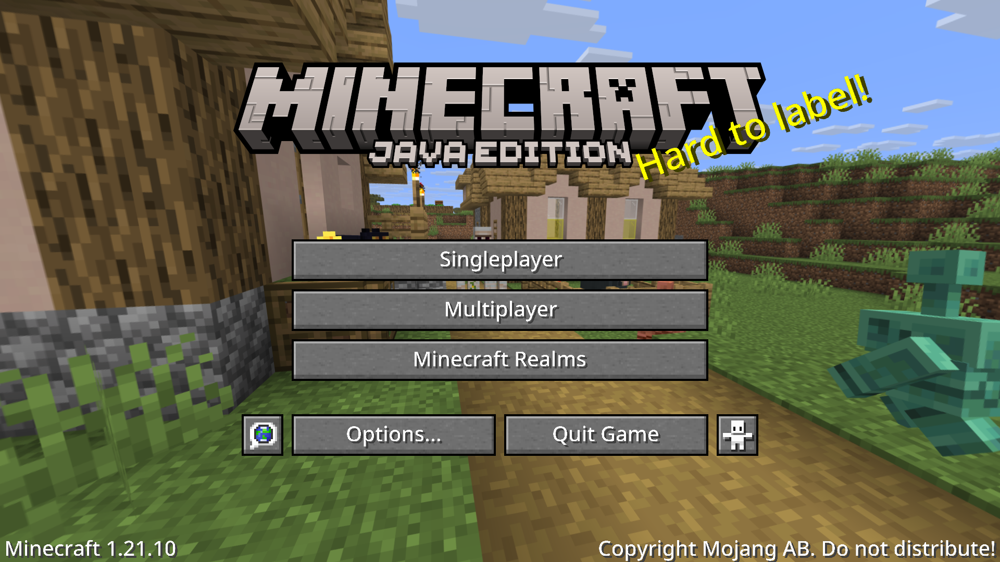

# Noto Sans Medium Typeface (Minecraft Java)

A clean and modern global typeface for Minecraft Java Edition.  
Supports multiple languages with a consistent, easy-to-read design.

## Features
- Based on **Noto Sans Medium**  
- Supports every language on Minecraft Java
- Clean and minimal look for UI and chat  
- Works for newest version Minecraft Java

## Installation
1. Download the `NotoSansMedium_Typeface.zip` file  
2. Move it to your `resourcepacks` folder  
3. Enable it in **Options → Resource Packs**

## Preview

## Credits
Typeface by **Google Fonts (Noto Project)**  
Resource pack by **Saransak Lueangoon**

